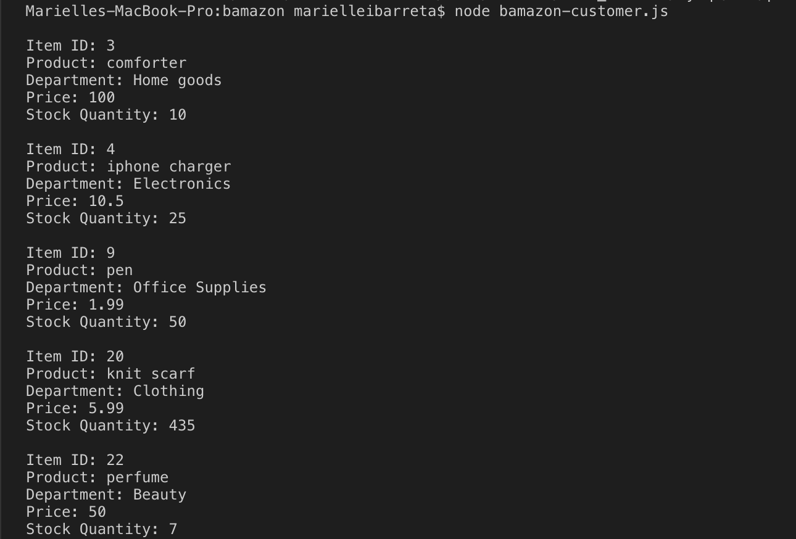

# bamazon

<h1>Go shopping now at Bamazon!</h1>
  
 Here's how it works:
 
 > You will need to download MySql to display in your own terminal and input your own password to your localhost. 
 > To run in node app just write: node bamazon.js
 Open up the product list to see what is on the market. Type in the number ID# of the item you are looking for and also how much you would like to buy of that item. (So far, this is where it ends) 

<<<<<<< HEAD

=======

>>>>>>> 6ff5fd4aafb9255243b184fd5da1665ae246ac51
